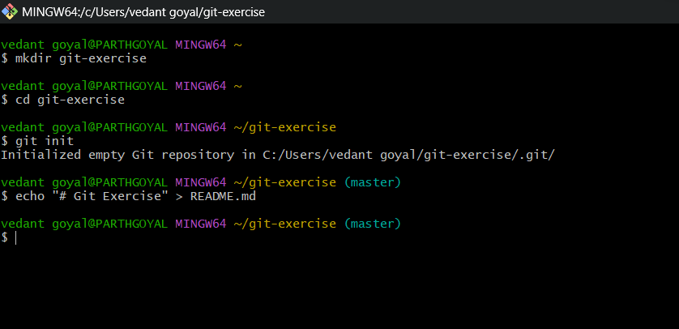
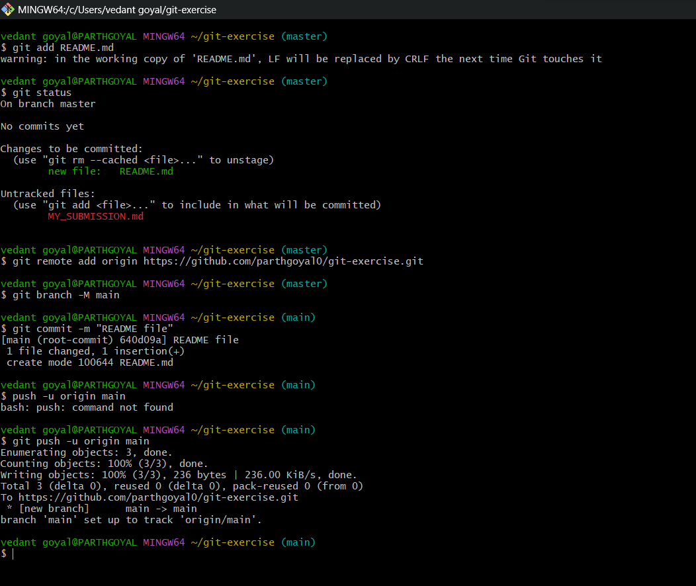
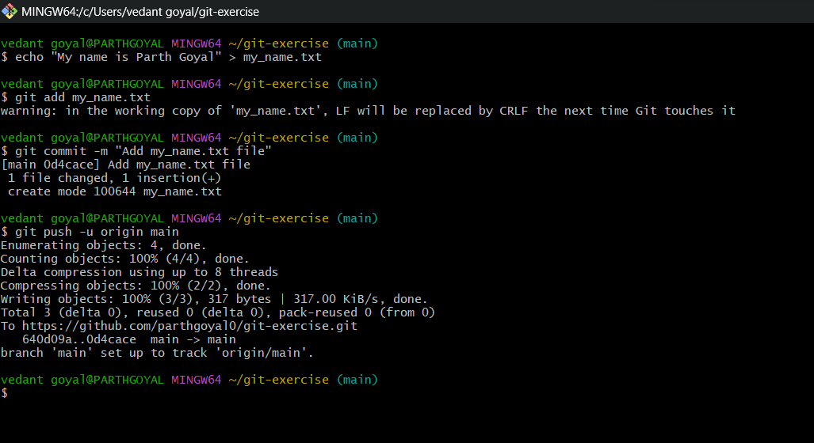
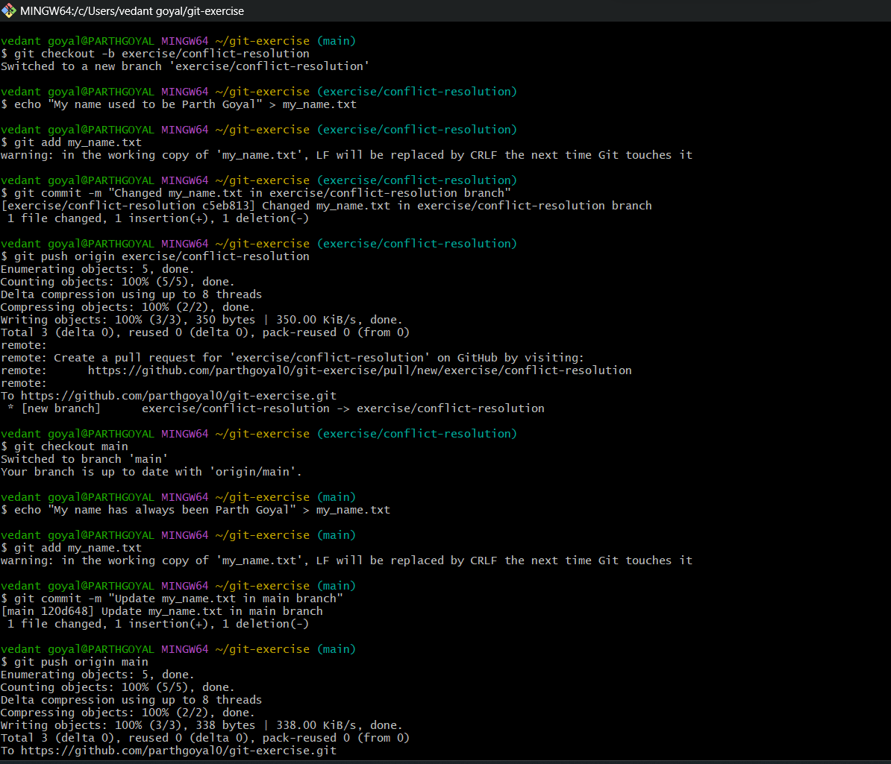
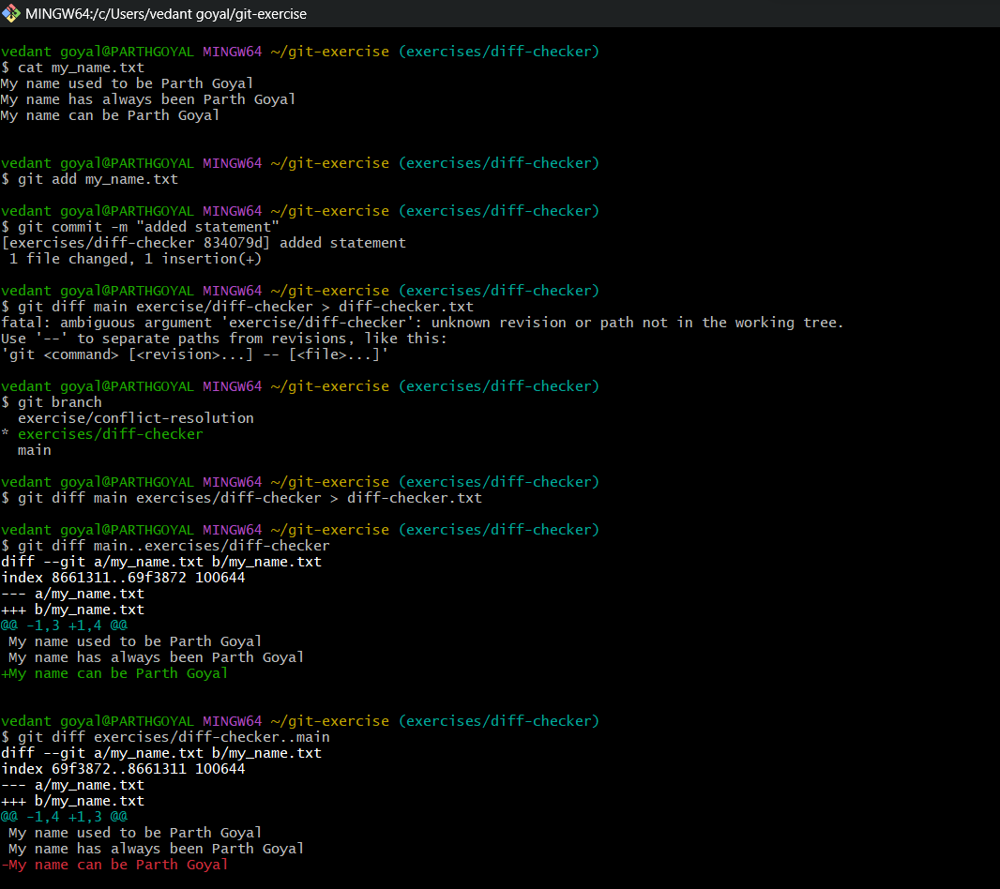
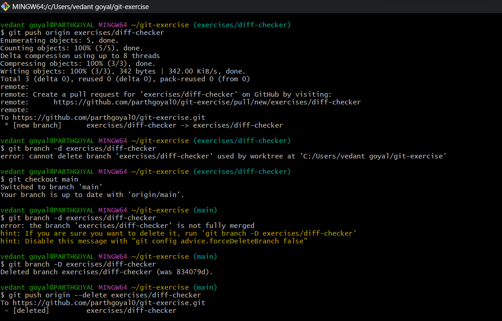
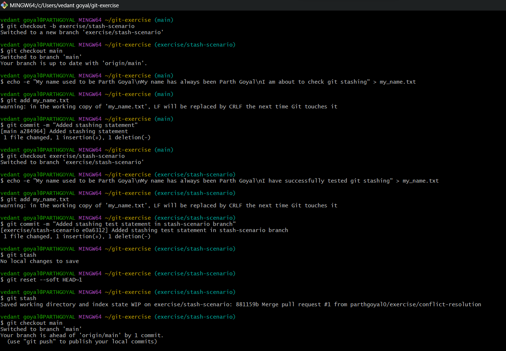
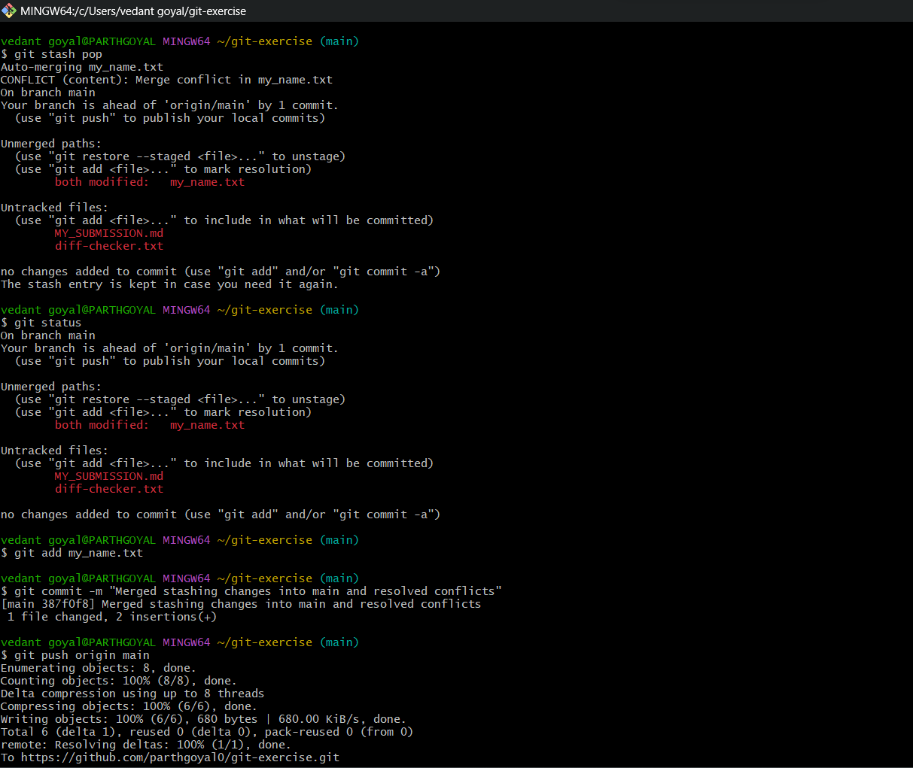
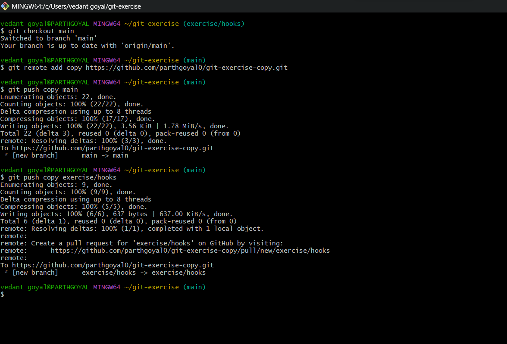
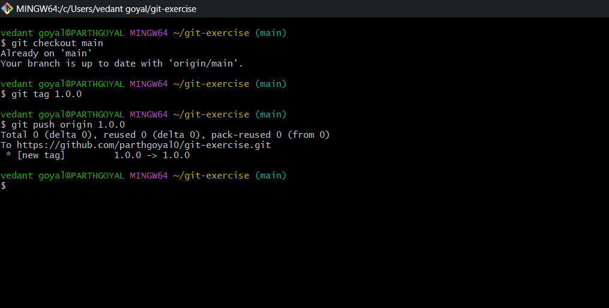

# My Submission


## Scenario 1: Create a Personal GitHub Repository and Create a README.md File

### 1: Create Local Repository :
  ```
  mkdir git-exercise
  cd git-exercise
  git init
  ```

### 2: Create README.md : 
  ```
  echo "# Git Exercise" > README.md
  ```

### 3: Create a Remote Repository on GitHub :

- Go to [GitHub] and sign in.
- Click on the **New repository** button.
- Fill in the repository details.
- Click **Create repository**.

### 4: Add Remote Repository and push files to Github :

- Copy the repository URL (e.g., `https://github.com/parthgoyal0/git-exercise.git`).

 ```
 git remote add origin https://github.com/your-username/git-exercise.git
 git push -u origin main
 ```

 
 
 


## Scenario 2: Add a New File and Commit

### 1: Create an Empty Folder and Add a File

- Create an empty folder on your machine with any name (already in `git-exercise`):
- Add a file named `my_name.txt` with the content:

    ```
    echo "My name is Parth Goyal" > my_name.txt
    ```
### 2: Stage and Commit the New File

- Add the new file to the staging area:

  ```
   git add my_name.txt
  ```
- Commit the file:
    ``` 
    git commit -m "Add my_name.txt file"
    ```
### 3: Push Changes to GitHub

- Push the changes to the remote repository:

    ```
    git push origin main
    ```





## Scenario 3: Branching, Conflict Resolution, and Pull Request on GitHub

### 1. Checkout to a New Branch
   - Create and switch to a new branch named `exercise/conflict-resolution`:

     ```
     git checkout -b exercise/conflict-resolution
     ```

### 2. Modify `my_name.txt` in `exercise/conflict-resolution` Branch
   - Change the content of `my_name.txt` to "My name used to be Parth Goyal":

     ```
     echo "My name used to be Parth Goyal" > my_name.txt
     ```
   - Stage and commit your changes:

     ``` 
     git add my_name.txt
     git commit -m "Changed my_name.txt in exercise/conflict-resolution branch"
     ```

### 3. Push Changes to Remote Branch
   - Push the changes to the remote `exercise/conflict-resolution` branch:

     ``` 
     git push origin exercise/conflict-resolution
     ```

### 4. Switch Back to Main Branch and Edit `my_name.txt`

   - Switch back to the main branch:

     ```
     git checkout main
     ```
   - Edit `my_name.txt` to "My name has always been Parth Goyal":

     ```
     echo "My name has always been Parth Goyal" > my_name.txt
     ```
   - Stage and commit changes:

     ```
     git add my_name.txt
     git commit -m "Update my_name.txt in main branch"
     ```

### 5. Push Changes to Remote Main Branch

   - Push the changes to the remote main branch:

     ```
     git push origin main
     ```

### 6. Create a Pull Request on GitHub

   - Go to the GitHub repository in your web browser.
   - Create a new pull request (PR) to merge `exercise/conflict-resolution` into `main` branch.
   - Ensure the expected content in `my_name.txt` after merging:

     ```
     My name used to be Parth Goyal
     My name has always been Parth Goyal
     ```

### 7. Complete Pull Request

   - Merge the pull request on Github.
   - After successful merge, delete the `exercise/conflict-resolution` branch from GitHub.

### 8. Sync Local Repository with Remote

   - Fetch any changes from remote:

     ```
     git fetch origin
     ```
   - Ensure your local main branch is up to date:

     ```
     git checkout main
     git pull origin main
     ```




## Scenario 4: Performing Content Differences Check Between Branches


### 1. Checkout to a New Branch
   - Create a new branch `exercises/diff-checker` and switch to it:
    
     ```
     git checkout -b exercises/diff-checker
     ```

### 2. Edit `my_name.txt`
   - Update `my_name.txt` with the specified content:
     ```
     My name used to be Parth Goyal
     My name has always been Parth Goyal
     My name can be Parth Goyal
     ```

### 3. Commit Changes
   - Stage and commit changes to the new branch:
     ```
     git add my_name.txt
     git commit -m "Added statement"
     ```

### 4. Check Content Differences
   - Compare `my_name.txt` between `main`  and `exercises/diff-checker` branches:
     ```
     git diff main..exercise/diff-checker
     git diff exercise/diff-checker..main
     ```




## Scenario 5: Push and Delete Branches 


### 1. Push the branch to remote

  ```
  git checkout exercise/diff-checker
  git push origin exercise/diff-checker
  ```

### 2. Switch to main branch

  ```
  git checkout main
  ```
### 3. Force delete local branch

  ```
  git branch -D exercise/diff-checker
  ```
### 4. Delete remote branch

  ```
  git push origin --delete exercise/diff-checker
  ```





## Scenario 6: Stash Scenario

### 1. Create a New Branch
   - Create a new branch `exercise/stash-scenario` and switch to it:

     ```
     git checkout -b exercise/stash-scenario
     ```

### 2. Switch Back to Main Branch and Add a Commit
   - Switch back to the main branch:

     ```
     git checkout main
     ```
   - Edit `my_name.txt` to include:

     ```
     echo -e "My name used to be Parth Goyal\nMy name has always been Parth Goyal\nI am about to check git stashing" > my_name.txt
     ```
   - Stage and commit your changes:

     ```
     git add my_name.txt
     git commit -m "Add stashing statement in main branch"
     ```

### 3. Switch to `exercise/stash-scenario` Branch and Edit File
   - Switch to the `exercise/stash-scenario` branch:

     ```
     git checkout exercise/stash-scenario
     ```
   - Edit `my_name.txt` to include:

     ```
     echo -e "My name used to be Parth Goyal\nMy name has always been Parth Goyal\nI have successfully tested git stashing" > my_name.txt
     ```

### 4. Stash Changes and Apply stash in main branch
   - Stash the changes:

     ```
     git stash
     ```
   - Switch back to the main branch:

     ```
     git checkout main
     ``` 

   - Apply the stashed changes in the main branch:

     ```
     git stash pop
     ```  


### 5. Final Content of `my_name.txt`
   - Ensure the content of `my_name.txt` is as follows:

     ```
     My name used to be Parth Goyal
     My name has always been Parth Goyal
     I am about to check git stashing
     I have successfully tested git stashing
     ```

### 6. Commit and Push Changes to Main Repository
   - Stage and commit the final changes:

     ```
     git add my_name.txt
     git commit -m "Merged stashing changes"
     ```
   - Push the changes to the remote repository:

     ```
     git push origin main
     ```





## Scenario 7:

### 1. Checkout to a New Branch exercise/hooks from main

   ```
   git checkout -b exercise/hooks
   ```

### 2. Create a new post-commit hook script (post-commit file in .git/hooks/)

   ```
   echo '#!/bin/bash' > .git/hooks/post-commit
   echo 'echo "This is the first post-commit hook from Parth Goyal"' >> .git/hooks/post-commit
   chmod +x .git/hooks/post-commit
   ```

### 3. Add and commit the new post-commit hook script.

   ```
   git add .git/hooks/post-commit
   git commit -m "Added post-commit hook"
   ```

### 4. Push the exercise/hooks branch to GitHub.

   ```
   git push origin exercise/hooks
   ```

### 5. Verify the Post-Commit Hook

   ```
   echo "Testing post-commit hook" >> my_name.txt
   git add README.md
   git commit -m "Test post-commit hook"
   ```   
### 6. Create a Merge Request

   ```
   Navigate to your GitHub repository and create a pull request from exercise/hooks branch to main branch.
   ```


## Scenario 8: Creating a Copy of the Repository

### 1. Move back to the main branch

```
git checkout main
```
### 2. Add the new remote repository

```
git remote add copy https://github.com/parthgoyal0/git-exercise-copy.git
```

### 3. Push all branches to the new remote repository

```
git push copy main
git push copy exercise/hooks
```



## Scenario 9: Creating and Pushing a New Tag


### 1. Checked out the `main` Branch

  ```
   git checkout main
  ```
### 2. Created a New Tag

  ```
  git tag 1.0.0
  ```
### 3. Pushed the Tag to GitHub


  ```
  git push origin 1.0.0
  ```


